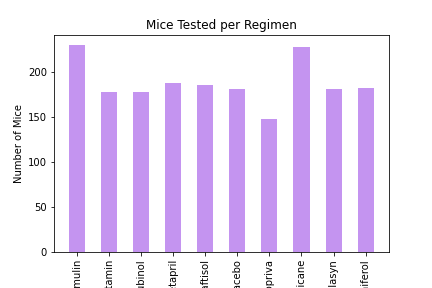
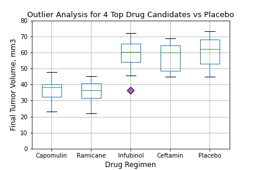
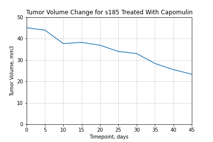
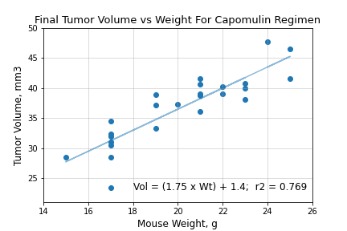

# Matplotlib Challenge

## Overview

The goal of this assignment was to process data from a controlled animal trial of an anti-cancer drug using Pandas, then use Matplotlib to extract meaning from that data using a variety of visualizations:

- Bar Chart
- Pie Chart
- Box Plot
- Line Plot
- Scatter Plot
- Linear Regression

## Implementation notes

### Pandas power

The assignment requires the bar and pie charts to be constructed using both vanilla PyPlot - passing 2 columns from a DataFrame - and directly off the DataFrame using the Pandas integration of PyPlot. The end result is neatercode that requires fewer arguments in a 1 line that would otherwise take 3:

Similarly, there is a requirement to build a summary statistics DataFrame in 2 ways, first by constructing a dictionary and passing it to the DataFrame constructor, and second using the Pandas aggregate function. The aggregate implementation is evidently simpler, although it requires some jimmying around with MultiIndexes.

`summary = df.agg(['mean', 'median', 'var', 'std', 'sem'])`

I also used *groupby* and *get_group* throughout the assignment to quickly retrieve subsets of the data, such to get the data for each drug regimen and extract data for individual mice from those subsets. I had some difficulty wrapping my head around the concepts of *groupby* in the Pandas assignment, but by this point it feels like second nature.

### Lambdas

Although not really part of the assignment, as a primarily JavaScript developer I do love lambda functions. There were a few good opportunities to use them: The *agg* function and *filter* function. With the *agg* function, lambdas allow you to pass in callbacks that aren't built-in functions like *mean*, such as *quantile*. And they're an elegant way to implement Python's *filter* function, which I used to get the outliers using a lambda that returns the result of a conditional much faster and more concise than using a *for* loop.

`list(filter(lambda vol: vol < lower_bound or vol > upper_bound, volumes))`

## Conclusions

### Efficacy

One thing jumps out almost immediately from the summary statistics: Capomulin and Ramicane are by far the most effective drugs in this study. They have the lowest means/medians and the tightest standard devations and SEM. This is backed up by the box plots, which clearly show the final tumor volumes more tightly clustered at a much lower level compared to 2 other drugs and placebo:

### Drug Action

The line plot for mouse s185 neatly demonstrates tumor size shrinkage with Capomulin. The effect is immediate and gradual, and appears to continue at the same rate throughout the course of treatment. This leads me to believe the tumor size would further decrease if the study were extended beyond the 45 day timepoint.

### Tumor Volume vs Weight

There is definitely a relationship between the mouse's weight and the final volume of their tumor, as can be seen from the scatter plot and linear regression. The equation for that regression could potentially be used as a correction factor in the previous analyses. We could generate similar correction factors for all drugs and use those to clean the data to correct for mouse weight.

